# sentinel_template

This repository is for easy testing things with sentinel and get some idea's on how to use it all. 

This sentinel policy checks by default if the terraform used is higher then version 1.4.0. If not the sentinel policy will fail. With this repository we will do the following

- Use the policy against a workspace
- Use the policy to test mock files

# Prerequisites

## Install terraform  
See the following documentation [How to install Terraform](https://learn.hashicorp.com/tutorials/terraform/install-cli)

## install sentinel
Download an install sentinel CLI tool from [here](https://docs.hashicorp.com/sentinel/downloads)

## TFE/TFC environment
Access to a TFE/TFC environment with admin permissions to create policy set and new workspace. 

# How to

## Configuring and using the policy

- Fork this repository to your own environment
- Clone it to your local machine. Change the url to your own repo
```
git clone https://github.com/munnep/sentinel_template.git
```
- Login to your TFE environment
- Create a new ClI driven workspace where we test the sentinel policy  
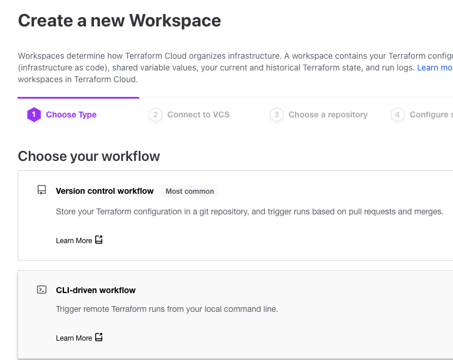  
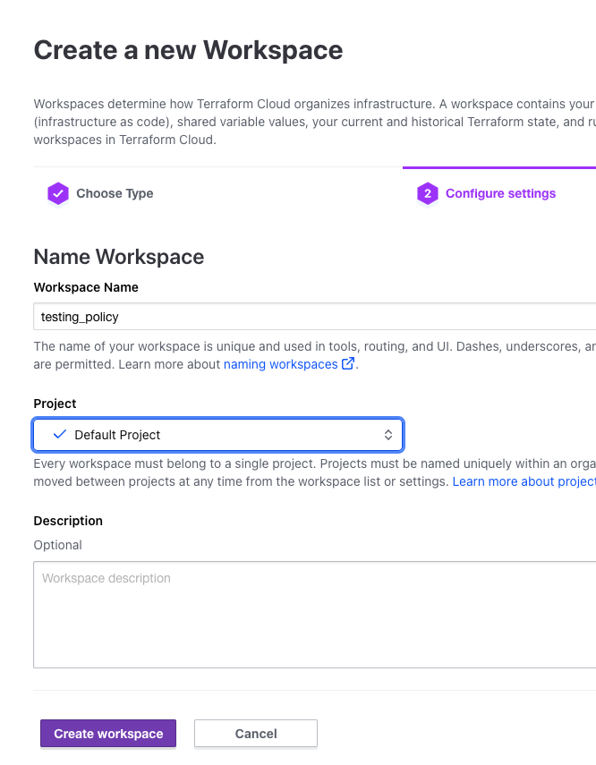  
- Change the Terraform version used on this workspace to version 1.3.0. Settings -> Terraform Version  
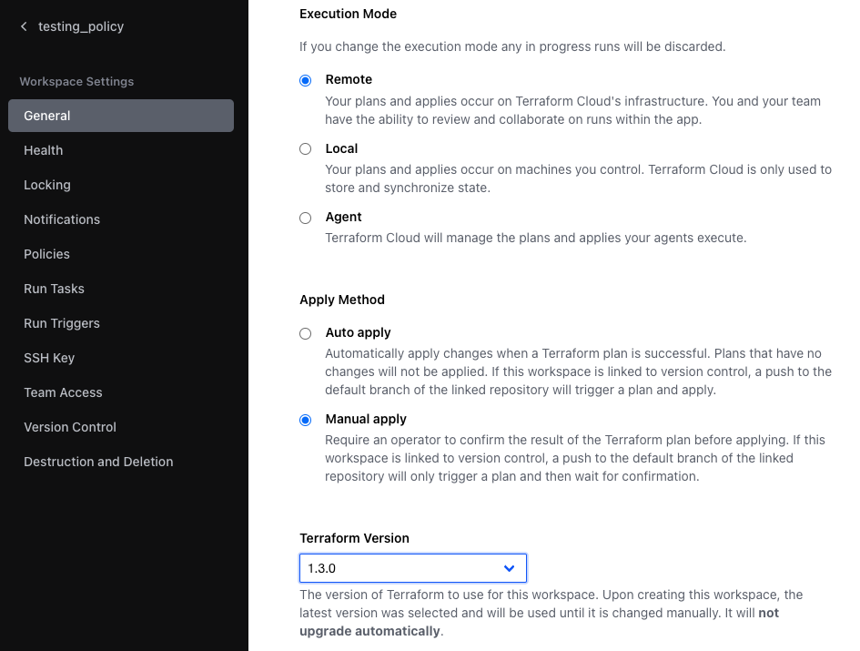  
- Go to settings -> Policy Sets  
  
- Click on Connect a new policy set  
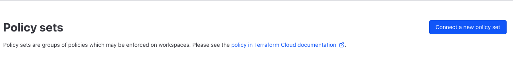  
- Select the VCS connection where the repository is stored  
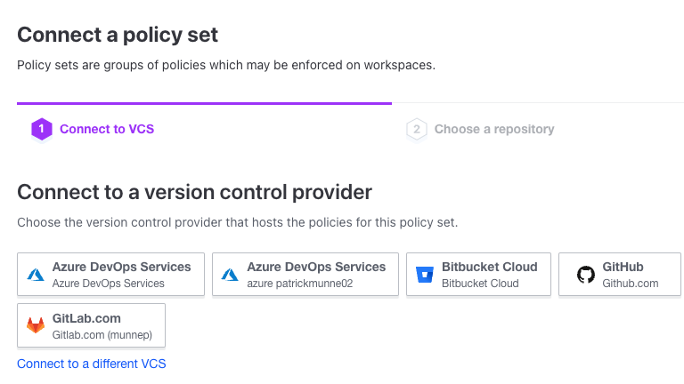
- select your repository
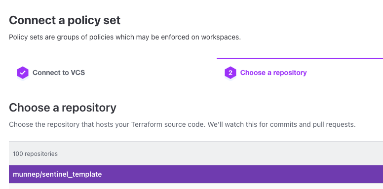  
- Give the policy a name and select the workspace on which it should be active. Example test_policy workspace
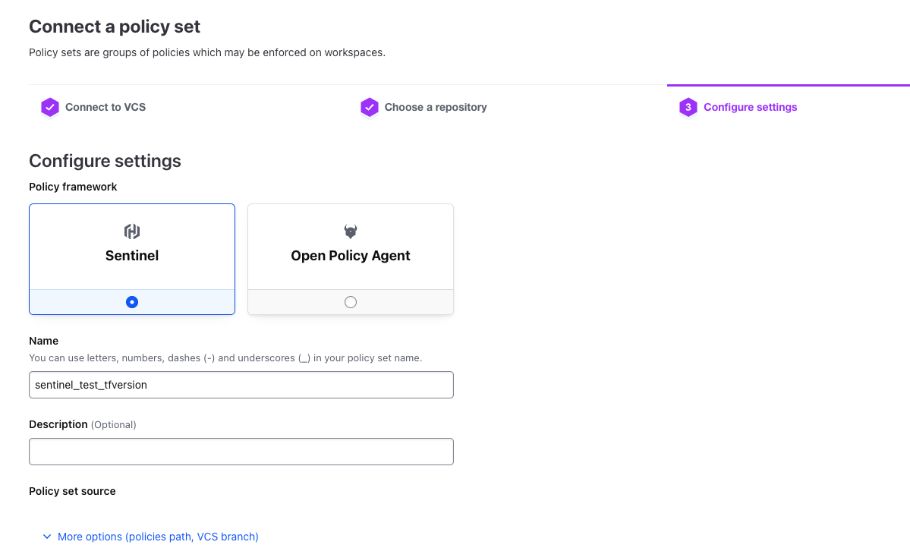  
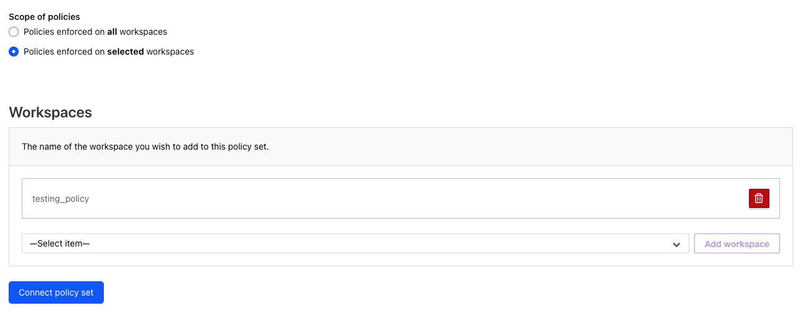  
- Connect the policy set  
  
- Do a run with that will cause the policy check to fail
- In this repository go into the directory `test_workspace`
```
cd test_workspace
```
- in the file `main.tf` change the terraform block to match you environment
- run terraform init
```
terraform init
```
- Do a terraform apply
```
terraform apply
```
- The run will be executed on TFE/TFC with terraform version 1.3.0 but the policy checks that it should be higher then 1.4.0. The output will show the following
```
================ Results for policy set: sentinel_test_tfversion ===============

Sentinel Result: false

This result means that one or more Sentinel policies failed. More than likely,
this was due to the discovery of violations by the main rule and other
sub-rules. Please see the details of the policies executed below to find the
violation(s), which is usually indicated by a rule with a false boolean value,
or non-zero collection data.

1 policies evaluated.

## Policy 1: sentinel_test_tfversion/tfversion (hard-mandatory)

Result: false

./tfversion.sentinel:8:1 - Rule "main"
  Value:
    false


╷
│ Error: Organization Policy Check hard failed.
│ 
│ 
╵
```
- We will create a sentinel parameter that checks the terraform version is allowed to be higher then 1.2.0 
- Go to settings -> Policy Sets -> <name of your policy set>  
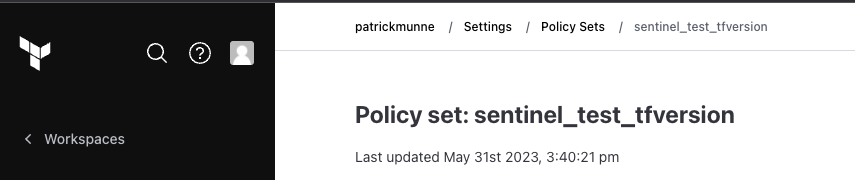  
- add a new sentinel parameter key `tfversion` an value `"1.2.0"`
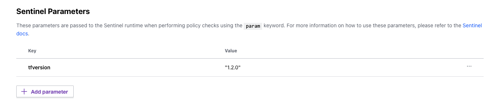  
-  Do another run on the workspace and see the result that the policy passes 
```
Organization Policy Check:

================ Results for policy set: sentinel_test_tfversion ===============

Sentinel Result: true

This result means that all Sentinel policies passed and the protected
behavior is allowed.

1 policies evaluated.

## Policy 1: sentinel_test_tfversion/tfversion (hard-mandatory)

Result: true

./tfversion.sentinel:8:1 - Rule "main"
  Value:
    true


------------------------------------------------------------------------
```

## Using mock files

You have now used the policy and see that it is working. You could also download the Mock files and test the sentinel policy locally. Follow the below steps

- In TFE/TFC go to the Workspace -> runs -> choose a run you did > Click on the Download Sentinel Mocks  
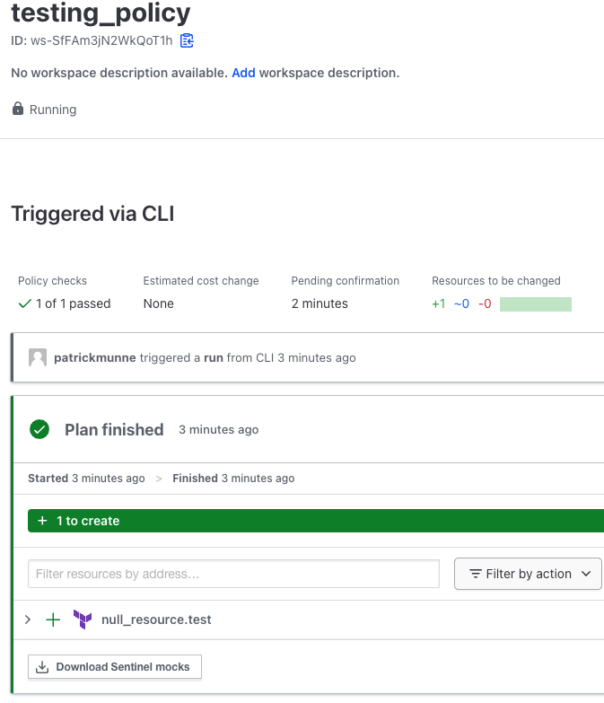  
- You now have a `tar.gz` on your machine
- Unpack this zipfile into the directory `testdata/` in this repo. (You can remove the files already there or us the Mock files from this repo)
- on the commandline execute the following sentinel command

```
sentinel test tfversion.sentinel
```
- We see that it fails because the version in the tfplan is 1.3.0 and we check if it is higher then version 1.4.0
```
FAIL - tfversion.sentinel
  FAIL - test/tfversion/fail.hcl
    expected "main" to be true, got: false

    trace:
      tfversion.sentinel:8:1 - Rule "main"
        Value:
          false
1 tests completed in 3.568391ms
```


